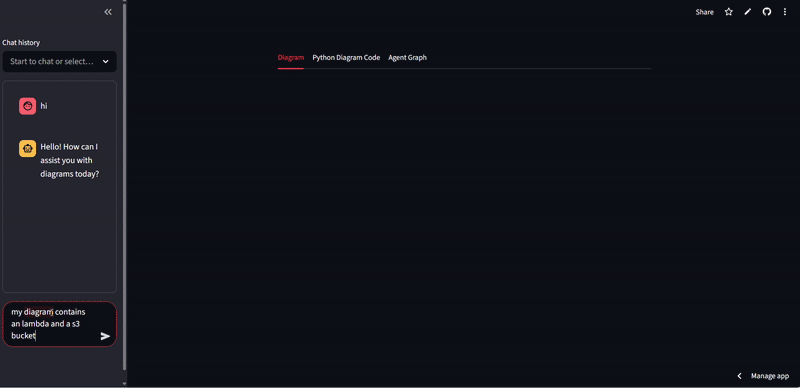

# Diagram Generator

A Streamlit-based web app for generating and visualizing architecture diagrams (e.g., AWS) using Python code.



## Features

- **Chat-driven diagram generation**: Describe your desired architecture in chat, and the app generates a diagram.
- **Python code preview**: View the Python code used to generate the diagram.
- **Download diagrams**: Download generated diagrams as images.
- **Agent graph visualization**: See the agent workflow as a flowchart.

## Agent Workflow

The agent workflow is a multi-step, stateful process that ensures only valid, executable code is used to generate diagrams and provides helpful feedback if errors occur.  
It is implemented using [LangGraph](https://github.com/langchain-ai/langgraph) for state management and transitions, OpenAI for language understanding, and Qdrant for documentation retrieval.

### How it works

1. **User Input**  
   The user provides a prompt (e.g., "Create an AWS architecture with a load balancer and two EC2 instances") via the chat interface.

2. **Assistant Node**  
   The agent’s assistant function uses an LLM (OpenAI) to:
   - Interpret the user’s request.
   - Generate the necessary Python `import_code` and `diagram_code` (for the [diagrams](https://diagrams.mingrammer.com/) library).
   - Compose a natural language response.

3. **Check for Diagram Code**  
   The workflow checks if both `import_code` and `diagram_code` were generated.  
   - If not, the workflow ends.

4. **Validate Imported Modules**  
   The agent checks if the generated import statements are valid Python modules.
   - If there are import errors, it proceeds to fetch documentation for those errors.
   - If there are no errors, it continues to diagram generation.

5. **Fetch Documentation for Errors**  
   If import errors are found, the agent queries a Qdrant vector database for relevant documentation snippets to help resolve the issues, then loops back to the assistant for further clarification or correction.

6. **Create Diagram Image**  
   If imports are valid, the agent executes the generated code to create the diagram image.
   - If successful, the workflow ends and the image/code are returned.
   - If not, it loops back to the assistant for further refinement.

### Visual Representation

Below is the agent graph that illustrates the workflow of the diagram generation process:


---

## Usage

1. **Install dependencies**  
   ```
   pip install -r requirements.txt
   ```

2. **Run the app**  
   ```
   streamlit run app.py
   ```

3. **Interact**  
   - Use the chat sidebar to request diagrams (e.g., "add a random aws diagram").
   - View and download diagrams in the main area.
   - Switch tabs to see Python code or the agent graph.

## Project Structure

```
diagram_generator/
├── agent/
│   ├── agent.py
│   └── utils/
│       ├── diagram_helper.py
│       └── qdrant_helper.py
├── app.py
├── README.md
├── services/
│   ├── alibabacloud.json
│   ├── aws.json
│   ├── azure.json
│   ├── firebase.json
│   ├── gcp.json
│   ├── generic.json
│   ├── ibm.json
│   ├── onprem.json
│   └── programming.json
└── ...
```

## Requirements

- Python 3.12+
- [Streamlit](https://streamlit.io/)
- [diagrams](https://diagrams.mingrammer.com/)

---

*This project is for generating and visualizing architecture diagrams